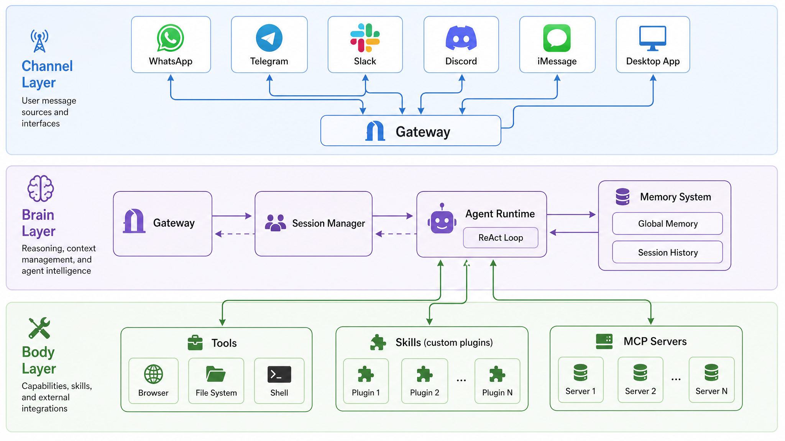
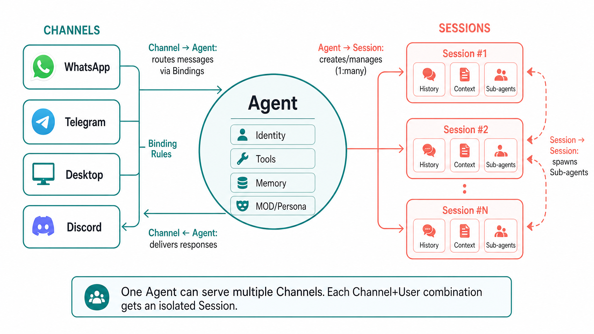
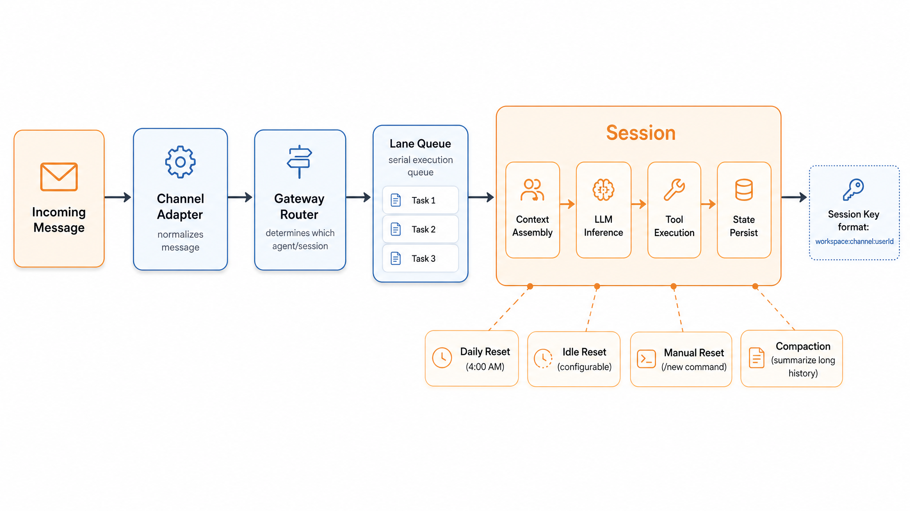

## 为什么要理解架构

OpenClaw 是一个开源的 AI 智能体框架——它不只是一个聊天机器人，而是一个能连接多个消息平台、调用各种工具、维护长期记忆的完整系统。我在实际使用过程中发现，很多问题（比如为什么消息没送达、为什么上下文丢了、为什么工具调用失败）都可以通过理解它的架构来快速定位。

这篇文章会拆解 OpenClaw 的核心概念，帮你建立一个清晰的心智模型。

## 三层架构

OpenClaw 的设计遵循一个直觉的三层模型：

**Channel Layer（通道层）**——系统的"感官"。负责对接各种消息平台（WhatsApp、Telegram、Slack、Discord、iMessage、桌面客户端等），把不同协议和格式的消息标准化为统一的内部格式。你可以把它想象成翻译官：不管用户用什么平台发消息，到了系统内部都是同一种语言。

**Brain Layer（大脑层）**——系统的"思考中枢"。这里运行着 Agent Runtime，执行 ReAct（Reason + Act）循环：接收输入 → 推理 → 决策 → 调用工具 → 观察结果 → 继续推理。所有的智能行为都在这一层发生。

**Body Layer（身体层）**——系统的"四肢"。包括浏览器操作、文件系统访问、Shell 命令执行、MCP Servers 对接、自定义 Skills 等。大脑层做出决策后，由身体层去实际执行。

这三层之间的关系很清晰：Channel 收消息 → Brain 想办法 → Body 干活 → Brain 整理结果 → Channel 回消息。

## 核心概念

### Gateway：神经中枢

Gateway 是整个系统的"神经系统"——一个 WebSocket 服务器，负责消息路由和会话管理。它是 Channel 和 Agent 之间的桥梁，所有消息都经过 Gateway 中转。

你可以把 Gateway 理解成一个电话总机：来电（用户消息）进来后，它根据规则决定转给哪个分机（Agent），然后把回复转回给来电者。一个 Gateway 可以同时管理多个 Agent，每个 Agent 服务不同的用户群体或场景。

### Agent：思考和行动的主体

Agent 是 OpenClaw 中执行 AI 操作循环的核心组件。它的职责包括：

- **组装上下文**：把会话历史、记忆、技能说明等拼装成给模型的 prompt
- **调用模型**：把上下文发给 LLM，获取推理结果
- **执行工具**：根据模型的决策调用相应的工具
- **持久化状态**：保存对话历史和学到的记忆

一个 Gateway 可以运行多个 Agent，每个 Agent 有自己独立的身份（SOUL.md）、工具集（Skills）和工作空间。打个比方，你可以在同一个 Gateway 上运行一个"工作助手"Agent 和一个"生活管家"Agent，它们各司其职，互不干扰。

### Session：对话的上下文容器

Session 是维护对话上下文和历史的容器。每当一个用户通过某个 Channel 和 Agent 交互时，系统就会为这个组合创建一个独立的 Session。

**Session Key** 的格式是 `workspace:channel:userId`，确保不同平台、不同用户的对话完全隔离。比如你在 Telegram 上和 Agent 聊的内容，不会混到 Slack 上的对话里。

Session 内部维护着完整的对话历史，并通过智能机制（裁剪工具结果、压缩长对话）控制上下文长度，避免 token 爆炸。

### Channel：连接世界的通道

Channel 是消息平台的适配器。每个 Channel 对应一个具体的消息平台，负责：

- 接收该平台的原始消息
- 转换为 OpenClaw 内部的标准格式
- 把 Agent 的回复转换回平台特定的格式并发送

系统通过 **Binding Rules**（绑定规则）来决定"来自哪个 Channel 的哪个用户的消息，应该由哪个 Agent 处理"。这是一种确定性路由规则，可以基于 channel 类型、账号、用户 ID、群组、角色等条件进行匹配。

### 它们如何协同

把这些概念串起来：

1. 用户在某个平台（比如 Telegram）发送一条消息
2. 对应的 Channel 接收消息，标准化后发给 Gateway
3. Gateway 根据 Binding Rules 找到应该处理这条消息的 Agent
4. Agent 查找或创建对应的 Session（基于 channel + userId）
5. Agent 在 Session 的上下文中执行 ReAct 循环
6. 结果通过 Gateway → Channel 原路返回给用户

一个 Agent 可以同时服务多个 Channel 的多个用户，每个用户各有自己隔离的 Session。

## Session 深入

Session 是 OpenClaw 中最值得深入理解的概念之一，因为很多实际使用中的"奇怪行为"都和它有关。

### 生命周期

Session 不是永久存在的，它有明确的生命周期：

- **每日重置**：默认在凌晨 4:00 重置，开启新的一天
- **空闲重置**：长时间没有交互后自动重置
- **手动重置**：用户发送 `/new` 命令主动开启新会话

重置意味着对话历史清空，Agent 从零开始——但这不代表它失忆了，因为重要信息已经被写入了 Memory（后面会讲）。

### 隔离级别

Session 的隔离通过 `dmScope` 配置，可以设置不同粒度：

- **main**（默认）：所有 Channel 的所有私聊共用一个 Session
- **per-peer**：每个用户一个独立 Session，跨 Channel 共享
- **per-channel-peer**（推荐）：每个 Channel + 用户组合一个独立 Session，同一用户在不同平台上的对话完全隔离

### Lane Queue：串行保证

这是一个容易被忽视但很重要的设计：每个 Session 有自己的 Lane Queue，强制所有消息串行处理。

为什么需要这个？想象一下，你快速连发三条消息。如果并行处理，Agent 可能在处理第一条时还不知道第二条的内容，导致回复混乱。Lane Queue 确保消息按顺序一条一条处理，虽然可能稍微慢一点，但保证了一致性。

### Sub-agent：后台工作者

有些任务很耗时（比如深度研究、大量文件处理），如果在主 Session 中执行，用户就要干等着。Sub-agent 就是为此设计的——它从当前 Session 中派生出来，运行在独立的隔离 Session 中，完成后向请求方报告结果。

你可以把它理解成主线程派出去的工作线程：主线程继续响应用户，工作线程在后台默默干活。

## 扩展机制

### Skills：可插拔的能力

Skills 是 OpenClaw 的能力扩展模块。每个 Skill 本质上是一份结构化的知识文件（通常是 Markdown），告诉 Agent"遇到某类任务时该怎么做"。

Skills 的强大之处在于：

- 可以热加载，不需要重启 Gateway
- 社区可以通过 ClawHub 等渠道共享和复用

### Memory：跨会话的持久记忆

Memory 解决了"Session 重置后 Agent 就失忆"的问题。它的核心文件是 **MEMORY.md**，存放在 Agent 工作空间中，存储跨会话的持久事实和偏好（比如"用户喜欢简洁的回复"）。

Memory 的一个优雅设计是：它对人类可审计——你可以直接打开 MEMORY.md 看 Agent 记住了什么，甚至手动编辑。检索时使用向量+关键词混合搜索（Hybrid Search），结合语义理解和精确匹配，确保相关记忆能被高效找到。

> **注意区分**：Memory 是持久记忆（MEMORY.md），Session History 是当前会话的对话记录——两者是不同层面的东西。Session 重置会清空对话历史，但 Memory 中的内容会保留。

### SOUL.md：人格定义

SOUL.md 是定义 Agent 人格和行为哲学的核心文件。OpenClaw 区分"做什么"（AGENTS.md）和"是谁"（SOUL.md）——SOUL.md 在每次会话启动时被注入系统 prompt，确保 Agent 保持一致的沟通风格、价值观和行为边界。它用纯 Markdown 编写，可以直接编辑，社区甚至形成了 ClawSouls 这样的开源项目来分享和安装预制的 personas。

### Bindings：路由规则

Bindings 是确定性的路由规则，决定"什么条件下的消息交给哪个 Agent"。可以基于：

- Channel 类型（比如 Telegram 的消息给 Agent A）
- 用户身份（比如 VIP 用户交给专属 Agent）
- 群组或角色（比如技术群的消息给技术 Agent）

## 总结

回顾一下 OpenClaw 的核心架构：

- **三层模型**让职责分明：Channel 管通信，Brain 管思考，Body 管执行
- **Gateway** 是神经中枢，串联一切
- **Agent** 是执行单元，跑 ReAct 循环
- **Session** 是上下文容器，提供隔离和串行保证
- **Channel** 是适配器，连接各种消息平台
- **Skills、Memory、SOUL.md、Bindings** 分别解决能力扩展、持久记忆、人格定义、消息路由的问题

理解了这些概念和它们之间的关系，再去使用和调试 OpenClaw 就会顺畅很多。如果你还没安装过，可以参考我之前写的安装教程；如果已经在用了，试着对照这篇文章去观察系统的行为，会有不少"原来如此"的时刻。
